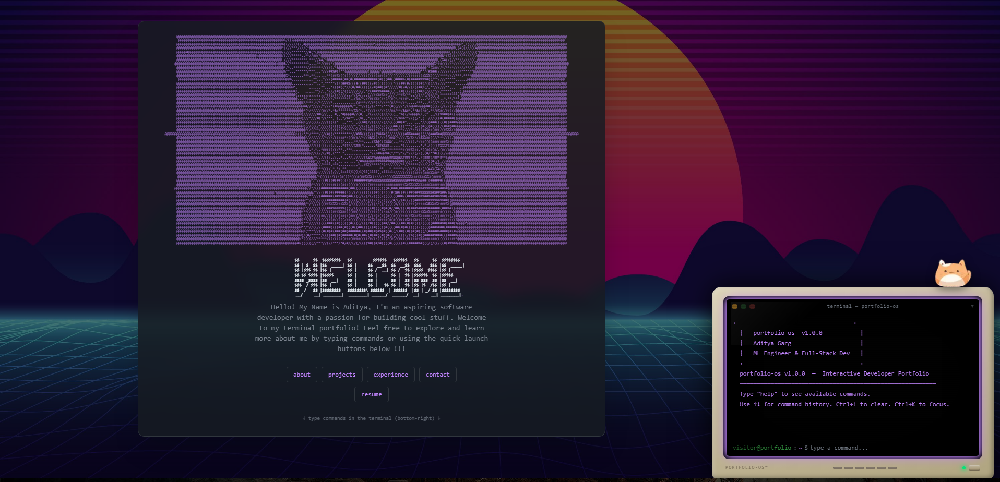
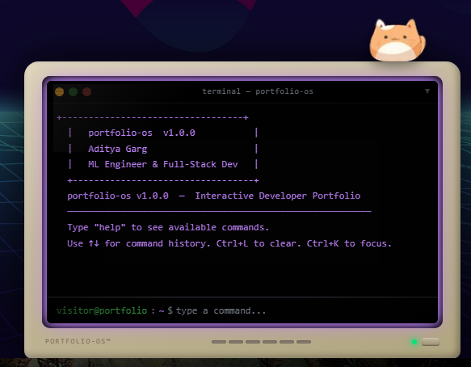
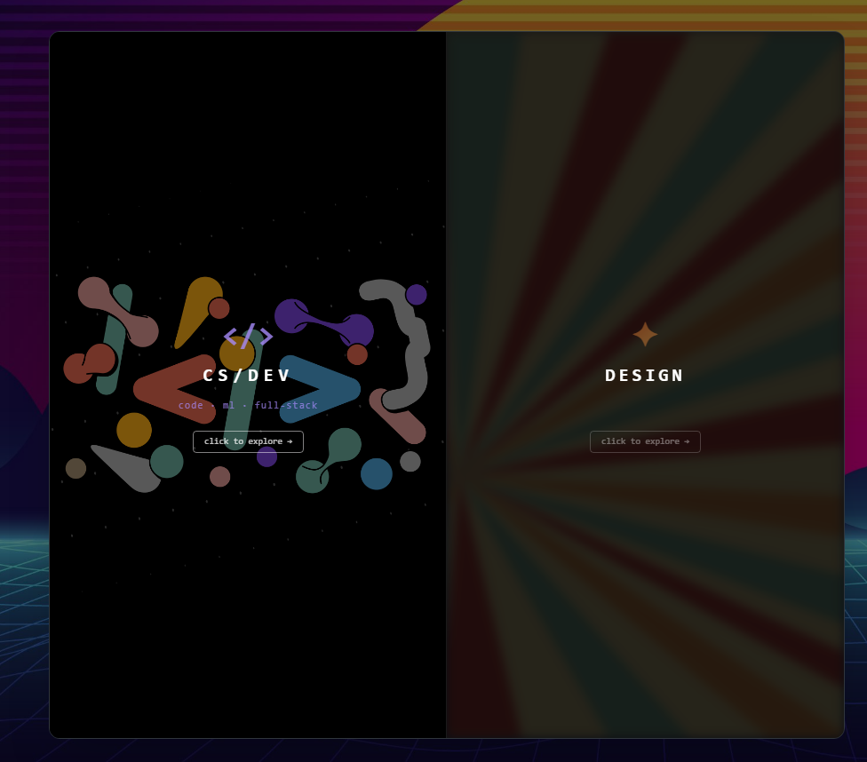
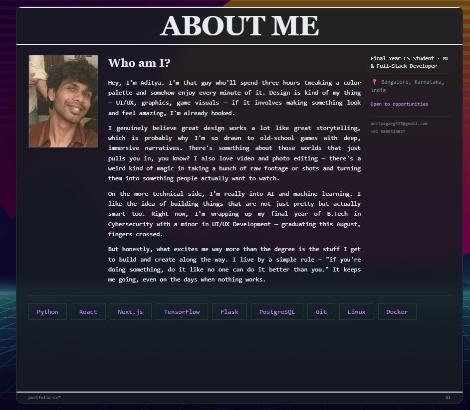
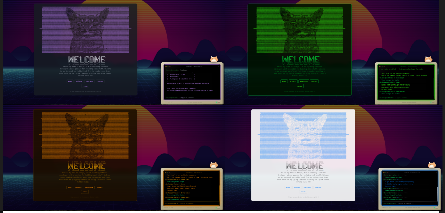
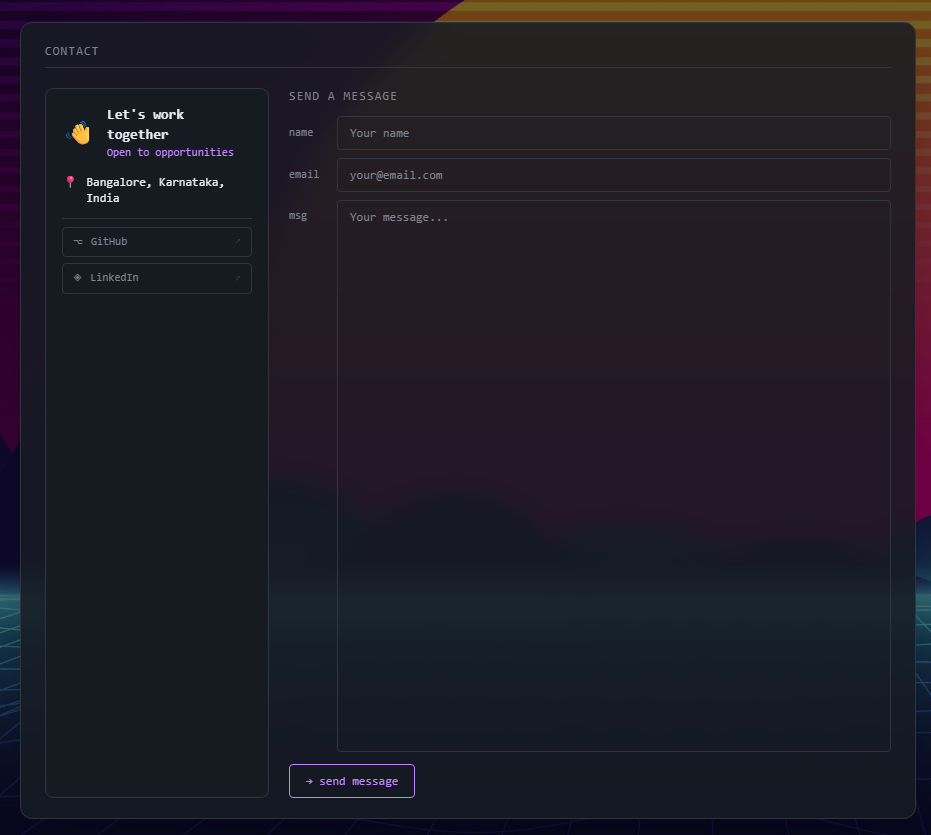

<div align="center">

# ⬛ Portfolio OS

### *A terminal-driven developer portfolio — where design meets code*


---

<!-- ============================================================ -->
<!-- 📸 SCREENSHOT #1 — Full hero shot                           -->
<!-- Capture: Full browser window showing homepage               -->
<!-- Shows: ASCII portrait + WELCOME banner + retrowave bg       -->
<!-- Window width: 1440px recommended                            -->
<!-- Save to: assets/hero.png                                    -->
<!-- ============================================================ -->



</div>

---

## ✦ What is this?

This is not your average portfolio. **Portfolio OS** is designed to feel like an operating system running inside your browser — complete with a **floating CRT monitor terminal**, **OS-style navigation**, a **retrowave animated wallpaper**, and **4 switchable color themes**.

Every detail is intentional — from the scanline overlay on the CRT screen, to the newspaper-style About page, to the blurred project panels that reveal themselves on hover. This project sits right at the intersection of **UI/UX craft and full-stack engineering**.

---

## 🎨 Design Showcase

> *Design was the first priority — engineering made it real.*

<br/>

### 🖥️ Retro CRT Monitor Terminal

A fully custom-built floating terminal styled as a **vintage CRT monitor**. Not a library — built entirely from scratch with CSS gradients and layered shadows.

**Details that matter:**
- Bezel with 3-stop gradient shading
- Inner screen lip with depth shadow
- Repeating scanline overlay
- Radial vignette effect
- Corner glare reflection
- Power LED with glow pulse
- A cat sitting on top 🐱

<!-- ============================================================ -->
<!-- 📸 SCREENSHOT #2 — CRT Terminal close-up                    -->
<!-- Capture: Bottom-right corner, terminal expanded             -->
<!-- Shows: Full CRT monitor bezel, cat, terminal content        -->
<!-- Tip: Dark theme looks best for this one                     -->
<!-- Save to: assets/crt-terminal.png                           -->
<!-- ============================================================ -->



---

### 🌅 Project Gallery — Hover Reveal

The projects section opens with a **split-screen panel selector**. Each panel's wallpaper is blurred and heavily darkened by default — then **sharpens and brightens on hover**, with the label spreading apart and the description fading in.

<!-- ============================================================ -->
<!-- 📸 SCREENSHOT #3 — Projects hover                           -->
<!-- Capture: Hover over one panel (CS/Dev or Design)           -->
<!-- Shows: One panel revealed + sharp, other still dark+blurry  -->
<!-- Tip: The contrast between the two sides is the money shot   -->
<!-- Save to: assets/projects-hover.png                         -->
<!-- ============================================================ -->



---

### 📰 Newspaper-Style About Page

The About section is designed as an **editorial layout** inspired by print newspapers — large masthead typography, structured multi-column content, and a vertical rotated name sidebar.

<!-- ============================================================ -->
<!-- 📸 SCREENSHOT #4 — About page                               -->
<!-- Capture: Full About view                                     -->
<!-- Shows: ABOUT ME masthead, photo, bio columns, skills row    -->
<!-- Save to: assets/about.png                                   -->
<!-- ============================================================ -->



---

### 🎨 4 Live Color Themes

Type `theme dark`, `theme light`, `theme hacker`, or `theme retro` in the terminal to switch the **entire UI's color palette in real time** — no page reload.

<!-- ============================================================ -->
<!-- 📸 SCREENSHOT #5 — Theme collage                            -->
<!-- Capture: 4 screenshots, one per theme, same view            -->
<!-- Stitch them as a 2×2 grid in Canva / Photopea              -->
<!-- Shows: How the same layout transforms across themes         -->
<!-- Save to: assets/themes.png                                  -->
<!-- ============================================================ -->



---

### 📬 Contact & Message

A split-panel contact page — info and social links on the left, a fully functional **message form** on the right that saves to PostgreSQL via a Next.js API route.

<!-- ============================================================ -->
<!-- 📸 SCREENSHOT #6 — Contact page                             -->
<!-- Capture: Full contact view, form visible                    -->
<!-- Shows: Two-column layout, social buttons, input fields      -->
<!-- Save to: assets/contact.png                                 -->
<!-- ============================================================ -->



---

## ⚙️ Tech Stack

| Layer | Technology |
|---|---|
| **Framework** | Next.js 16 (App Router) |
| **UI Library** | React 19 |
| **Styling** | Tailwind CSS v4 |
| **Animations** | Framer Motion |
| **State Management** | Zustand |
| **Database** | PostgreSQL (Neon serverless) |
| **ORM** | Prisma v7 |
| **Deployment** | Vercel + GitHub Actions CI |

---

## 🚀 Features

- 🖥️ **OS-style terminal navigation** — type commands to navigate the portfolio
- 📟 **Custom CRT monitor widget** — hand-crafted retro terminal aesthetic
- 🌊 **Retrowave wallpaper** — vaporwave landscape background
- 🎨 **4 live color themes** — dark · light · hacker · retro
- 📁 **Project gallery** — CS/Dev & Design split with hover-reveal backgrounds
- 📰 **Newspaper About layout** — editorial print-inspired design
- 📄 **Inline resume view** — full resume rendered as HTML + PDF download
- 📬 **Contact form** — messages saved to PostgreSQL via API
- ⌨️ **Keyboard shortcuts** — `` ` `` toggle · `Ctrl+L` clear · `Ctrl+K` focus
- 📊 **Visitor analytics** — session & command logging to database
- 🐱 **Cat on the monitor** — the most important feature

---

## ⌨️ Terminal Commands

| Command | Action |
|---|---|
| `help` | List all commands |
| `about` | View bio and profile |
| `projects` | Browse project gallery |
| `experience` | Work history & education |
| `contact` | Contact info & send message |
| `resume` | View resume inline |
| `theme [dark\|light\|hacker\|retro]` | Switch color theme |
| `history` | Show command history |
| `clear` | Clear terminal |

**Shortcuts:** `` ` `` toggles terminal · `Ctrl+L` clears · `Ctrl+K` focuses input

---

## 🛠️ Running Locally

```bash
# Clone
git clone https://github.com/your-username/portfolio-os.git
cd portfolio-os

# Install
npm install

# Add your DATABASE_URL to .env
echo 'DATABASE_URL="postgresql://..."' > .env

# Push schema & generate client
npx prisma db push
npx prisma generate

# Run
npm run dev
```

Open [http://localhost:3000](http://localhost:3000) — type `help` in the terminal to start.

---

## 📁 Project Structure

```
portfolio/
├── app/
│   ├── page.tsx                # Root page (wallpaper + layout)
│   ├── globals.css             # CSS variables & global styles
│   └── api/
│       ├── message/route.ts    # POST — saves contact messages
│       └── log/route.ts        # POST — logs visitor commands
├── components/
│   ├── Terminal/               # CRT monitor + terminal + command registry
│   └── ContentPanel/           # All views: Home, About, Projects, etc.
├── data/                       # All content as TypeScript files
├── store/                      # Zustand global state
├── styles/                     # Theme color definitions
└── public/                     # Static assets + wallpapers
```

---

## 🌍 Deployment

1. Push repo to GitHub
2. Import on [vercel.com](https://vercel.com)
3. Add `DATABASE_URL` in Vercel → Settings → Environment Variables
4. Vercel auto-runs `prisma generate && next build` on every push

---

## ✏️ Editing Content

All personal content lives in `/data/` — no component changes needed:

| File | Controls |
|---|---|
| `data/about.ts` | Name, bio, location, availability |
| `data/projects.ts` | Project cards, tech, links |
| `data/experience.ts` | Work history & education |
| `data/socials.ts` | Social links |

---

<div align="center">

Made with obsessive attention to detail by **[Aditya Garg](https://github.com/Aditya-G-22)**

*"If you're doing something, do it like no one can do it better than you."*

</div>
